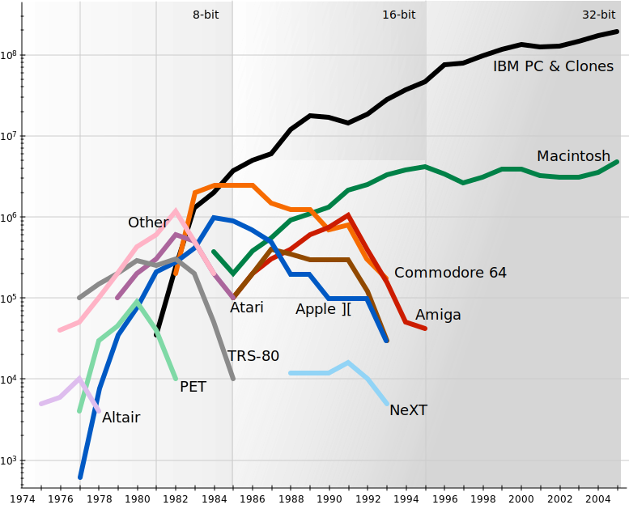

2018-08-19 18:03:37
Future History
Always looking at the Shape of Things to Come, by Looking Backward.

Looking again at the [data from Jeremy Reimer][0] on the first wave of "personal computer" sales. This used to matter, as sales demand funds innovation in computing.

These days, computers are so cheap, people use them for a couple of years and then throw them out. Cheap because the vendors get steady recurring revenue via subscription for services like network access to supercomputer resources.

But at first, people would spend that money on a big appliance, like a large, very expensive microwave oven sitting on your desk.

I plotted Jeremy's data here, and then pondered what seem to be three phases to the personal computer as a technology product.

There are certainly many ways to slice this, and indeed the market settled into a bit of bifurcation before modularity — the commoditization in the form of a standard Windows PC — disrupted the industry. That story is everywhere, and it's a good story. But there is lots to tell of the fertile chaos, before the universe became transparent.

Intel x86 servers and "personal computers" alike, all bear vestigal organs from those first wild times. As they go to sleep, and when they wake, they dream of that early time of their ancestors. The 8-bit and 16-bit devices that started it all.

# References

- [Personal Computer Market Share 1975-2010][0]
- [Notes on Sources][1]
- [Asymco][2]

[0]: http://jeremyreimer.com/m-item.lsp?i=137               "Personal Computer Market Share 1975-2010"
[1]: http://jeremyreimer.com/uploads/notes-on-sources.txt   "Notes on Sources"
[2]: http://www.asymco.com/2012/01/17/the-rise-and-fall-of-personal-computing/ "The Rise and Fall of Personal Computing"
